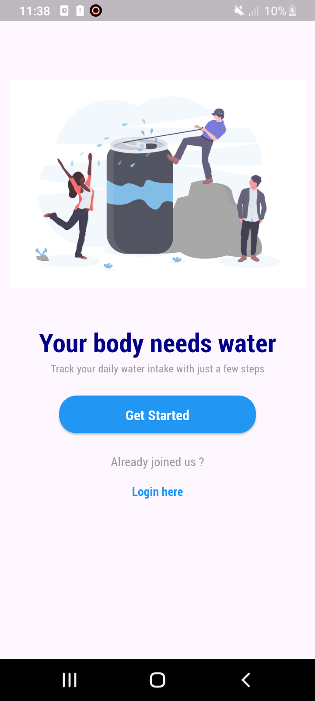
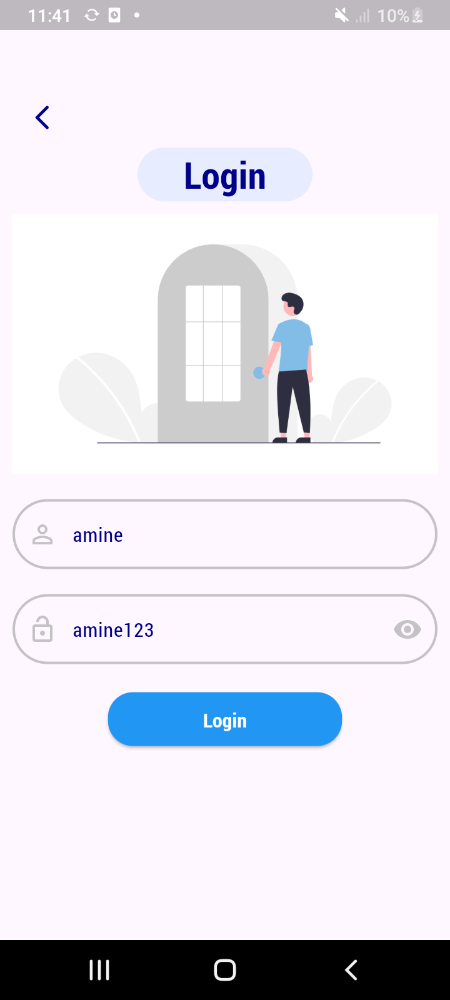
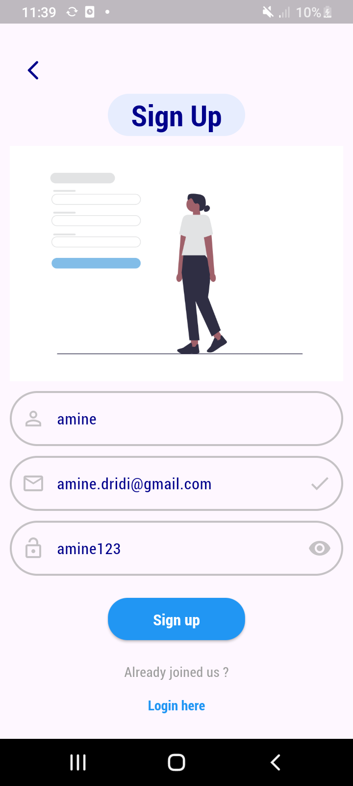
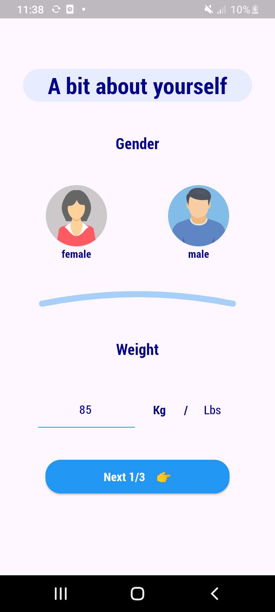
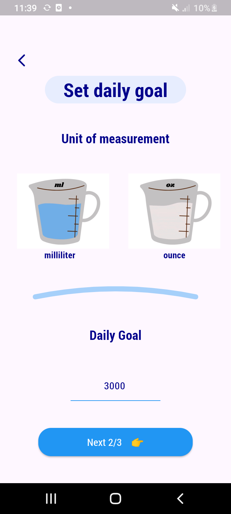
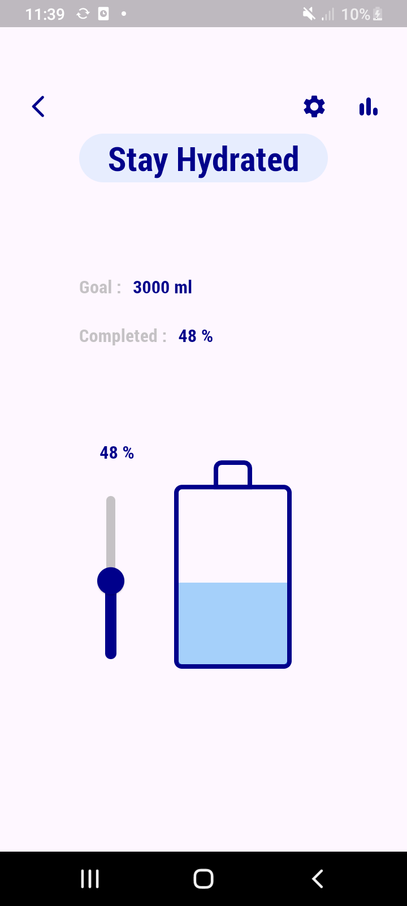
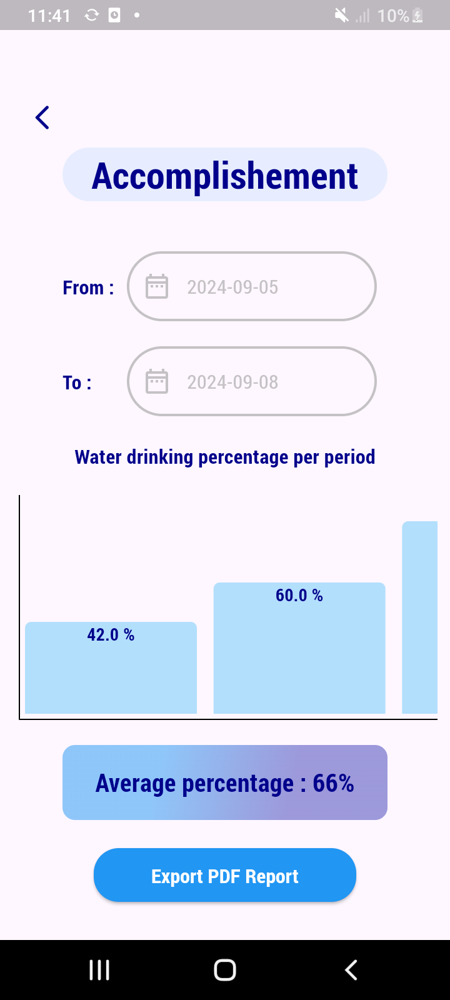
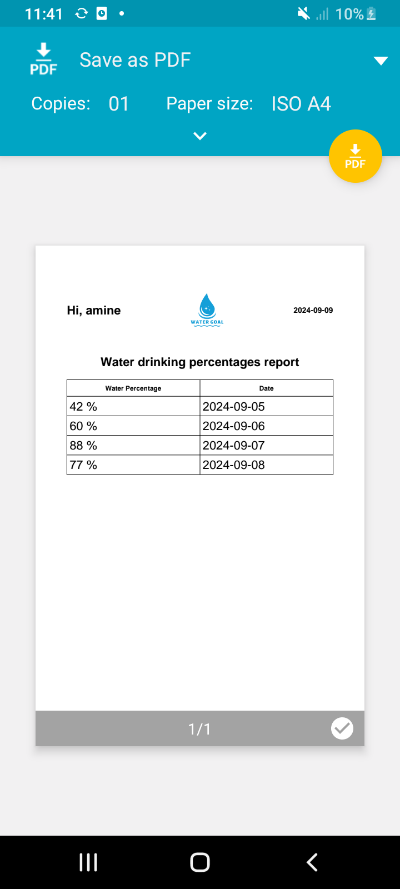
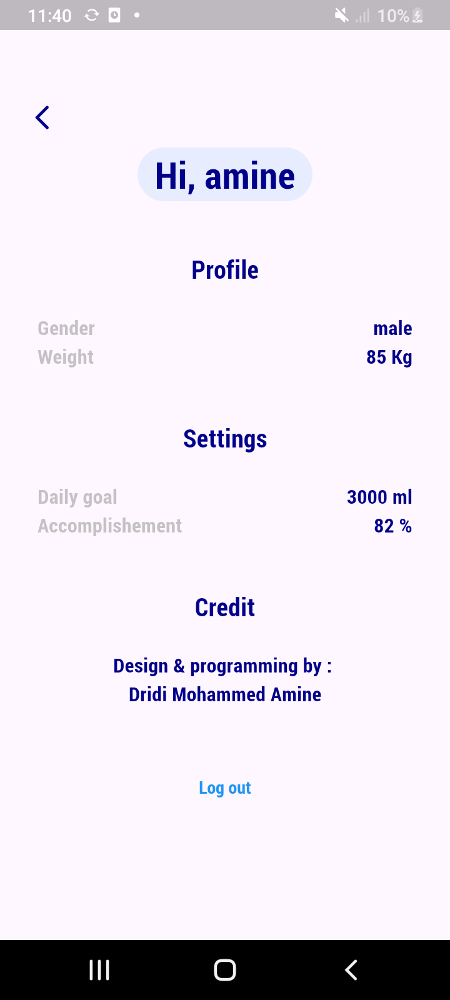

# 💧 Water Habit Tracking App (( WATER GOAL ))

A modern **Flutter mobile application** designed to help you track and improve your daily water intake. With a focus on user experience, this app provides personalized insights, visual statistics, and report generation to help you reach your hydration goals.

-------------------------------------------------------------------------------------------------------------------------------

## 🚀 Features

1. **Track Daily Water Intake**:
   - Keep track of the percentage of water you've consumed throughout the day.
   - Automatically save your daily water intake for review and analysis.

2. **Advanced Statistics**:
   - View detailed charts and statistics showing your water consumption trends over time.
   - Calculate and display your average daily intake over a specific period.

3. **Generate PDF Reports**:
   - Export your water intake data into a structured PDF report.
   - Use the report to review your progress over a specific date range or share it with others.

4. **Local Data Storage**:
   - All your water intake data is stored locally using **SQLite**.
   - Data is secure and can be accessed even without an internet connection.

5. **Customized Water Bottle Visual**:
   - The app uses **CustomPaint** to create a unique water bottle shape, giving you a visual representation of your hydration progress.

6. **State Management with BLoC**:
   - Implemented using the **BLoC** (Business Logic Component) pattern, making the app scalable and easy to maintain.
   - Ensures efficient state management and a responsive UI.

7. **Charts and Graphs**:
   - Integrated with the **charts package** to display your water intake trends.
   - Helps visualize improvements and compare daily performance over time.

8. **WorkManager Integration**:
   - Automatically captures and saves your final daily water percentage at midnight (00:00) using the **workmanager** package.
   - Works in the background, even when the app is closed, ensuring that your water intake is tracked without manual input.

9. **Shared Preferences**:
   - Stores light user preferences (such as settings and user behaviors) using **Shared Preferences** for a smooth and personalized experience.

-------------------------------------------------------------------------------------------------------------------------------

## 🛠️ Technologies Used

- **Flutter**: For building the mobile application with a rich, responsive UI.
- **Clean Architecture**: To make structured project hierarchy and to make project easy for maintenability and scalability.
- **SQLite**: Local database to securely store water intake & user data (Local CRUD Operations).
- **BLoC**: State management for scalable, maintainable code.
- **CustomPaint package**: To design and display the water bottle UI element.
- **charts package**: For displaying visual water intake statistics in specific period of time.
- **workmanager package**: To schedule tasks for automated water tracking at the end of the day.
- **Shared Preferences**: For storing light user preferences (settings, behaviors).
- **PDF Generation**: Exporting water intake data as a shareable PDF report.

-------------------------------------------------------------------------------------------------------------------------------

## 📱 Screenshots

Here are a screenshots from the application:

### GetStarted Page

### Login Page

### SignUp Page

### Gender & Weight Selection Page

### Set Daily Goal : Water Measurement Goal Value & Unit Selection Page

### Current Water Percentage Setter Page

### Results , Statistics & Reporting Page

### PDF View Page

### Profile Settings Page

-------------------------------------------------------------------------------------------------------------------------------

## 🎥 Demo

Check out the demo of my application on YouTube:

[Watch the demo video](https://youtu.be/16RTQRLVTH8)

